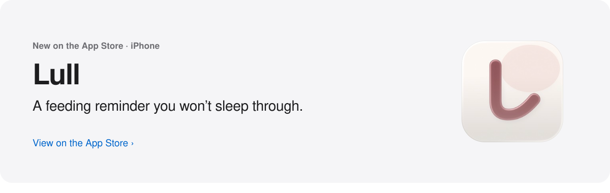
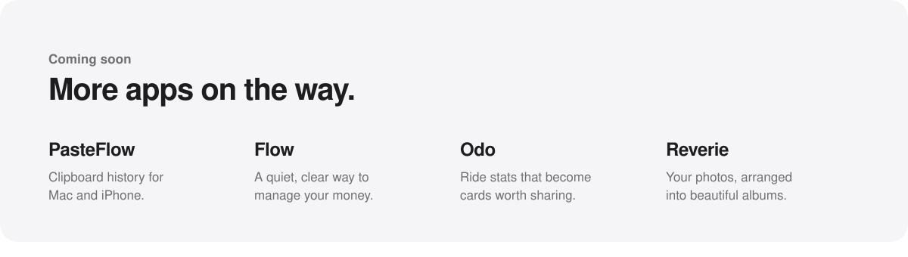
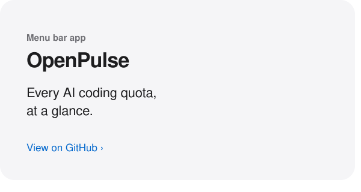
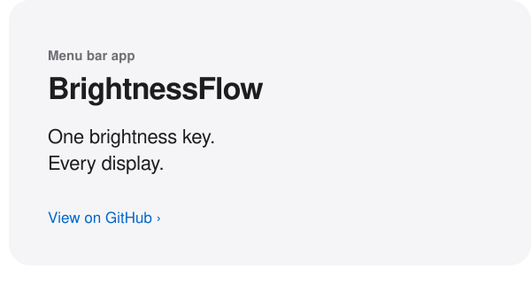
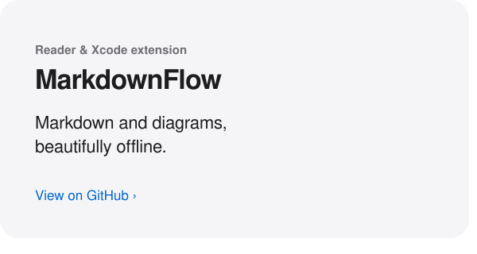
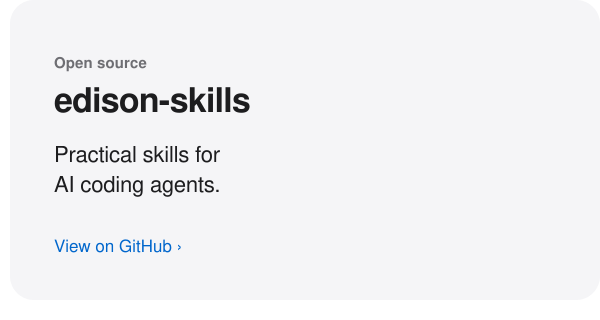

<picture>
  <source media="(prefers-color-scheme: dark)" srcset="assets/hero-dark.svg">
  
</picture>

<a href="https://apps.apple.com/app/id6803735715"><picture><source media="(prefers-color-scheme: dark)" srcset="assets/lull-dark.svg"></picture></a><picture><source media="(prefers-color-scheme: dark)" srcset="assets/soon-dark.svg"></picture><a href="https://github.com/fanyu/OpenPulse"><picture><source media="(prefers-color-scheme: dark)" srcset="assets/openpulse-dark.svg"></picture></a><a href="https://github.com/fanyu/BrightnessFlow"><picture><source media="(prefers-color-scheme: dark)" srcset="assets/brightnessflow-dark.svg"></picture></a><a href="https://github.com/fanyu/MarkdownFlow"><picture><source media="(prefers-color-scheme: dark)" srcset="assets/markdownflow-dark.svg"></picture></a><a href="https://github.com/fanyu/edison-skills"><picture><source media="(prefers-color-scheme: dark)" srcset="assets/edisonskills-dark.svg"></picture></a>

